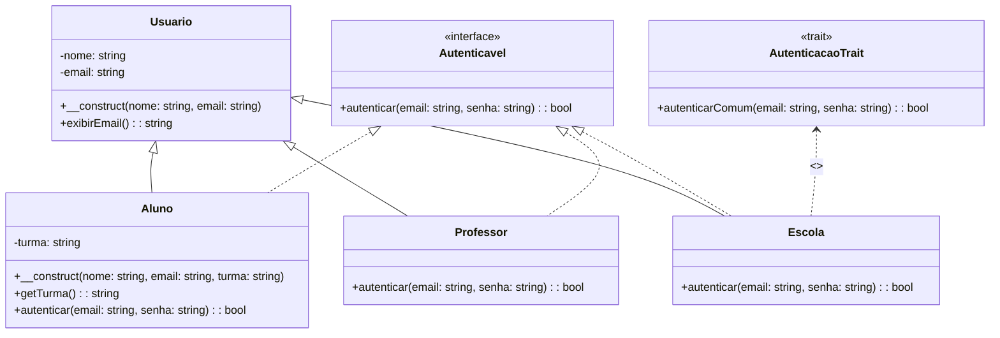

# 📘 Herança, Contratos e Reutilização: Orientação a Objetos

Este guia mostra como aplicar conceitos de **orientação a objetos**, utilizando `extends`, `implements` e `trait` para organizar melhor a lógica de autenticação, promover o reaproveitamento de código e estruturar hierarquias de classes de forma eficiente.

---

## 💡 1. `extends`: Herança de Classes

A palavra-chave `extends` é usada quando uma classe herda de outra. Isso permite reutilizar código e comportamentos.

### ✅ Exemplo:

```php
class Usuario {
    protected string $nome;
    protected string $email;

    public function __construct(string $nome, string $email) {
        $this->nome = $nome;
        $this->email = $email;
    }

    public function exibirEmail(): string {
        return $this->email;
    }
}

class Aluno extends Usuario {
    private string $turma;

    public function __construct(string $nome, string $email, string $turma) {
        parent::__construct($nome, $email);
        $this->turma = $turma;
    }

    public function getTurma(): string {
        return $this->turma;
    }
}
```

### 🧠 Importante:
- Só é possível herdar **uma única classe** (sem herança múltipla).
- É possível sobrescrever métodos da classe pai usando o mesmo nome.

---

## 💡 2. `implements`: Implementação de Interfaces

A palavra-chave `implements` é usada quando uma classe se compromete a **implementar todos os métodos de uma interface**.

### ✅ Exemplo:

```php
interface Autenticavel {
    public function autenticar(string $email, string $senha): bool;
}

class Professor implements Autenticavel {
    public function autenticar(string $email, string $senha): bool {
        return $email === 'prof@iescola.com' && $senha === 'senha123';
    }
}

class Aluno implements Autenticavel {
    public function autenticar(string $email, string $senha): bool {
        return $email === 'aluno@iescola.com' && $senha === 'aluno456';
    }
}
```

### 🧠 Importante:
- Uma classe pode implementar **várias interfaces**.
- Todos os métodos da interface devem ser **obrigatoriamente implementados**.

---

## 💡 3. `trait`: Compartilhamento de Comportamento

Traits são uma forma de **reutilização de código** que permite compartilhar métodos entre classes sem recorrer à herança.  
**Importante:**  
- **Reuso sem herança:** Ideal para adicionar funcionalidades comuns em classes que não compartilham uma relação hierárquica.  
- **Resolução de Conflitos:** Se múltiplos traits tiverem métodos com o mesmo nome, o PHP permite resolver conflitos explicitamente.  
- **Não é herança:** Traits não podem ser instanciados por si só; eles simplesmente adicionam funcionalidades às classes que os usam.

### ✅ Exemplo:

```php
trait AutenticacaoTrait {
    public function autenticarComum(string $email, string $senha): bool {
        // Lógica compartilhada
        return $email !== '' && $senha !== '';
    }
}

class Escola implements Autenticavel {
    use AutenticacaoTrait;

    public function autenticar(string $email, string $senha): bool {
        return $this->autenticarComum($email, $senha);
    }
}
```

---

## 🧱 Aplicação

Use:

- `extends` para criar **hierarquias lógicas** (ex: `Usuario` → `Professor`, `Aluno`).
- `implements` para aplicar **polimorfismo** — diferentes classes com a mesma assinatura de método (útil para login, notificações, relatórios).

---

## 📌 Diferença Resumida: `extends` x `implements` x `trait`

| Característica        | `extends`                        | `implements`                                | `trait`                                |
|-----------------------|----------------------------------|---------------------------------------------|----------------------------------------|
| **O que é?**          | Herança de outra classe          | Implementação de contrato (interface)       | Compartilhamento de métodos entre classes |
| **Reuso de Código**   | Reutiliza toda a lógica da classe base | Garante a implementação dos métodos definidos na interface | Permite reutilizar métodos específicos sem herança |
| **Instanciamento**    | Pode instanciar a classe base (se não for abstrata) | Não pode ser instanciada (apenas contratos) | Não pode ser instanciado; só é usado em classes |

---

## 🎯 Diagrama UML - Herança, Interface e Trait



### ✅ Interpretação rápida:
- `Aluno`, `Professor` e `Escola` herdam de `Usuario` com `extends`.
- Todos implementam a interface `Autenticavel` com `implements`.
- `Escola` usa o trait `AutenticacaoTrait`, o que evita duplicação de código.

---

## 🔚 Conclusão

Neste guia, vimos como:  
- **`extends`** permite criar hierarquias de classes, promovendo a reutilização de código;  
- **`implements`** garante que classes cumpram um contrato, possibilitando o polimorfismo;  
- **`trait`** permite compartilhar comportamentos comuns entre classes sem depender de uma hierarquia.

Essa organização facilita o desenvolvimento de sistemas mais modulares, flexíveis e manuteníveis.

---

**Autor:** Fabrício de Medeiros\
**Projeto:** i-Escola — Sistema de Gerenciamento Escolar
