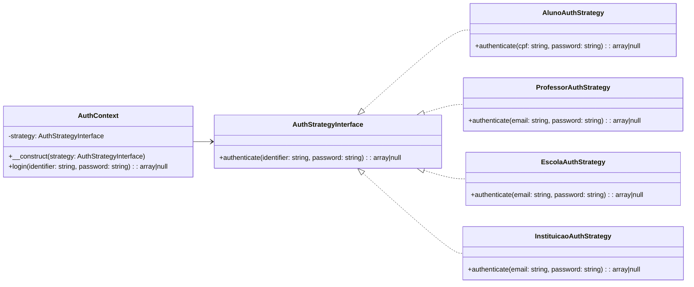

# Módulo de Autenticação com Strategy

## Visão Geral
Este documento complementa a documentação geral sobre o módulo de autenticação do sistema **i-Escola**, aprofundando o uso do padrão Strategy aplicado a diferentes entidades que possuem estruturas de autenticação distintas. Ele visa guiar a implementação técnica considerando a modelagem atual do banco de dados.

## Entidades e Modelagem de Dados
O sistema possui autenticação baseada nas seguintes entidades, com tabelas distintas para informações e senhas:

| Entidade       | Tabela de Dados        | Tabela de Senhas            | Identificador Primário | Tipo de Login       |
|----------------|-------------------------|------------------------------|--------------------------|---------------------|
| Aluno          | tbl_alunos              | tbl_alunosenhas             | id_aluno                | CPF + Senha         |
| Professor      | tbl_professores         | tbl_professorsenhas         | id_professor            | Email + Senha       |
| Escola         | tbl_escola              | tbl_escolasenhas            | id_escola               | Email + Senha       |
| Instituição     | tbl_instituicoes         | tbl_instituicaosenhas       | id_instituicao          | Email + Senha       |

## Requisitos de Autenticação
- Cada tipo de usuário deve ser autenticado utilizando seu identificador principal (CPF ou Email) e a senha criptografada.
- As senhas estão armazenadas em tabelas separadas por entidade.
- A autenticação deverá retornar os dados completos do usuário autenticado (sem senha).

## Design Orientado a Objetos

### Interface de Estratégia
```php
interface AuthStrategyInterface {
    public function authenticate(string $identifier, string $password): ?array;
}
```

### Estratégias Concretas
Cada classe concreta implementa a `AuthStrategyInterface` e trata a lógica específica de autenticação da sua entidade:

```php
class AlunoAuthStrategy implements AuthStrategyInterface {
    public function authenticate(string $cpf, string $password): ?array {
        // Busca por CPF na tbl_alunos e verifica senha em tbl_alunosenhas
    }
}

class ProfessorAuthStrategy implements AuthStrategyInterface {
    public function authenticate(string $email, string $password): ?array {
        // Busca por email na tbl_professores e verifica senha em tbl_professorsenhas
    }
}

class EscolaAuthStrategy implements AuthStrategyInterface {
    public function authenticate(string $email, string $password): ?array {
        // Busca por email na tbl_escola e verifica senha em tbl_escolasenhas
    }
}

class InstituicaoAuthStrategy implements AuthStrategyInterface {
    public function authenticate(string $email, string $password): ?array {
        // Busca por email na tbl_instituicoes e verifica senha em tbl_instituicaosenhas
    }
}
```

### Contexto de Autenticação
```php
class AuthContext {
    private AuthStrategyInterface $strategy;

    public function __construct(AuthStrategyInterface $strategy) {
        $this->strategy = $strategy;
    }

    public function login(string $identifier, string $password): ?array {
        return $this->strategy->authenticate($identifier, $password);
    }
}
```

## Responsabilidades Distribuídas (Princípios SOLID)
- **S** (Responsabilidade única): Cada Strategy cuida apenas da autenticação de sua entidade.
- **O** (Aberto/Fechado): Podemos adicionar novos tipos de autenticação sem alterar as existentes.
- **L** (Substituição de Liskov): As subclasses implementam o mesmo contrato (`AuthStrategyInterface`).
- **I** (Segregação de Interface): A interface tem apenas os métodos relevantes.
- **D** (Inversão de Dependência): O Contexto depende da abstração da interface, não das implementações.

## Diagrama


## Considerações de Segurança
- Senhas devem ser armazenadas com hashing seguro (ex: `password_hash`).
- O login deve retornar apenas dados relevantes do usuário (sem senhas).
- Usar prepared statements (PDO) para evitar SQL Injection.

## Próximos Passos
1. Implementar os repositórios de consulta para cada entidade e sua respectiva senha.
2. Adaptar o Controller para utilizar o `AuthContext` com a `Strategy` correta baseada no tipo de usuário.
3. Criar testes automatizados unitários para cada Strategy.
4. Validar o processo de login para todos os perfis.

---

**Autor:** Fabrício de Medeiros\
**Projeto:** i-Escola — Sistema de Gerenciamento Escolar
