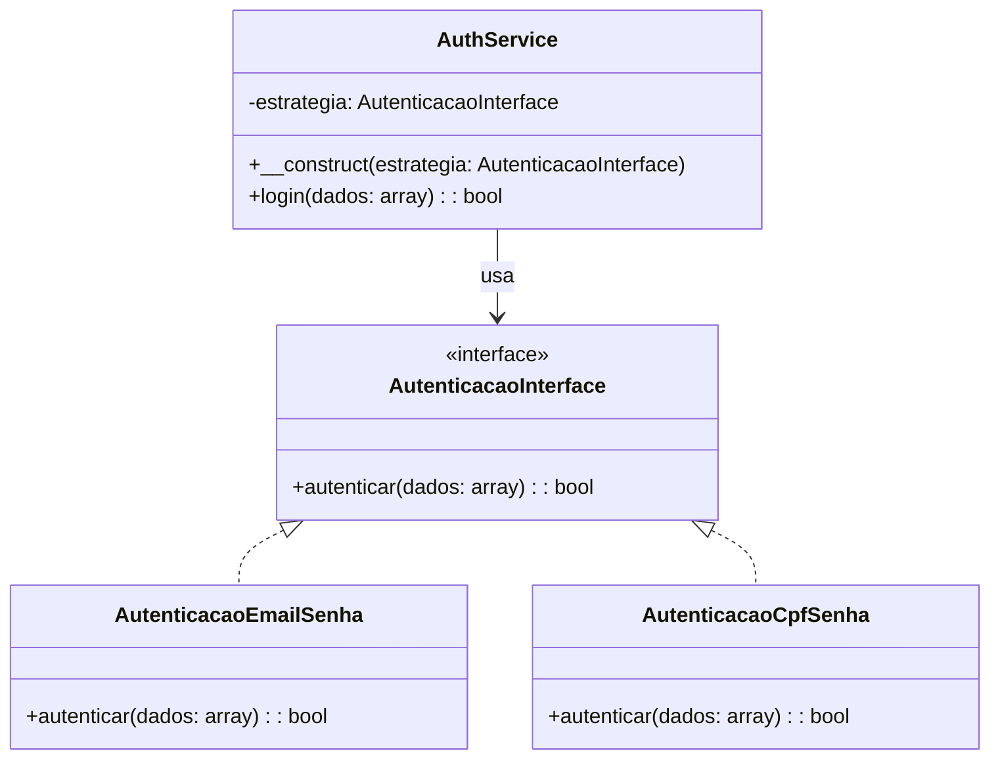

# Sistema de Autenticação Unificado

## Visão Geral

Este documento descreve a arquitetura e implementação da funcionalidade de *autenticação unificada* do **i-Escola — Sistema de Gerenciamento Escolar**. A proposta é centralizar o processo de login para diferentes tipos de usuários (Instituição, Escola, Professor, Aluno), utilizando o padrão de projeto **Strategy**, com forte adesão aos princípios do **SOLID** para garantir um sistema extensível.

---

## Fundamentos de Engenharia de Software Aplicados

### Padrão de Projeto: Strategy

O padrão **Strategy** permite definir uma família de algoritmos, encapsulá-los e torná-los intercambiáveis. No contexto do i-Escola, isso permite que diferentes formas de autenticação (por e-mail/senha e CPF/senha) sejam implementadas independentemente e selecionadas dinamicamente conforme o tipo de usuário.

**Benefícios:**

- Separa o comportamento da autenticação da lógica do serviço principal (desacoplamento);
- Facilita a extensão para novos tipos de login sem alterar o código existente (Open/Closed Principle);
- Garante substituibilidade (Liskov Substitution Principle) ao tratar todas as estratégias como implementações de uma interface comum.

O Liskov Substitution Principle (LSP) — Princípio da Substituição de Liskov — é um dos princípios do SOLID e foi formulado por Barbara Liskov em 1987.

### Princípios SOLID Aplicados

1. **S - Single Responsibility Principle** Cada classe tem uma responsabilidade clara: `AuthService` gerencia o fluxo de autenticação, enquanto as classes de estratégia cuidam da lógica específica de validação.

2. **O - Open/Closed Principle** O sistema está aberto para extensão (novos tipos de login) e fechado para modificação (nenhum impacto no serviço principal).

3. **L - Liskov Substitution Principle** `AuthService` pode operar com qualquer implementação da interface `AutenticacaoInterface`, sem saber sua implementação interna.

4. **I - Interface Segregation Principle** A interface `AutenticacaoInterface` é simples, coesa e não obriga a implementação de métodos desnecessários.

5. **D - Dependency Inversion Principle** `AuthService` depende da abstração (`AutenticacaoInterface`) e não das classes concretas, promovendo inversão de dependência e injeção de dependência.

---

## Requisitos

### Funcionais

- Permitir que **escolas** e **professores** se autentiquem com **e-mail e senha**.
- Permitir que **alunos** se autentiquem com **CPF e senha**.
- Centralizar a autenticação em uma única classe de serviço (`AuthService`).

### Não Funcionais

- Arquitetura extensível e modular.
- Alta manutenibilidade.
- Segurança e validação de dados de entrada.

---

## Diagrama UML



---

## Estrutura de Arquivos

```
App
└── Service
    ├── AuthService.php
    ├── AutenticacaoInterface.php
    ├── AutenticacaoEmailSenha.php
    └── AutenticacaoCpfSenha.php
```

---

## Implementação

### 1. Interface

```php
namespace App\Service;

interface AutenticacaoInterface {
    public function autenticar(array $dados): bool;
}
```

### 2. Estratégia para Professor/Escola

```php
class AutenticacaoEmailSenha implements AutenticacaoInterface {
    public function autenticar(array $dados): bool {
        $email = $dados["email"] ?? '';
        $senha = $dados["senha"] ?? '';
        // Lógica de validação com o banco
        return true;
    }
}
```

### 3. Estratégia para Aluno

```php
class AutenticacaoCpfSenha implements AutenticacaoInterface {
    public function autenticar(array $dados): bool {
        $cpf = $dados["cpf"] ?? '';
        $senha = $dados["senha"] ?? '';
        // Lógica de validação com o banco
        return true;
    }
}
```

### 4. Serviço Central

```php
class AuthService {
    private AutenticacaoInterface $estrategia;

    public function __construct(AutenticacaoInterface $estrategia) {
        $this->estrategia = $estrategia;
    }

    public function login(array $dados): bool {
        return $this->estrategia->autenticar($dados);
    }
}
```

### 5. Exemplo de uso no Controller

```php
$tipo = $_POST["tipo_usuario"];

switch ($tipo) {
    case 'aluno':
        $autenticador = new AutenticacaoCpfSenha();
        break;
    case 'professor':
    case 'escola':
        $autenticador = new AutenticacaoEmailSenha();
        break;
    default:
        throw new Exception('Tipo de usuário inválido');
}

$authService = new AuthService($autenticador);
$dados = $_POST;

if ($authService->login($dados)) {
    echo 'Login bem-sucedido!';
} else {
    echo 'Credenciais inválidas.';
}
```

---

## Próximos Passos

- Criar testes automatizados para cada estratégia de autenticação.
- Documentar os contratos com PHPDoc.
- Integrar com o sistema de sessão atual do i-Escola.
- Adicionar logs de tentativa de login.

---

## Considerações Finais

A centralização da autenticação torna o sistema mais **seguro** e **flexível** para novas funcionalidades, como autenticação por token, QR code, ou integração com sistemas governamentais.

---

**Autor:** Fabrício de Medeiros\
**Projeto:** i-Escola — Sistema de Gerenciamento Escolar
