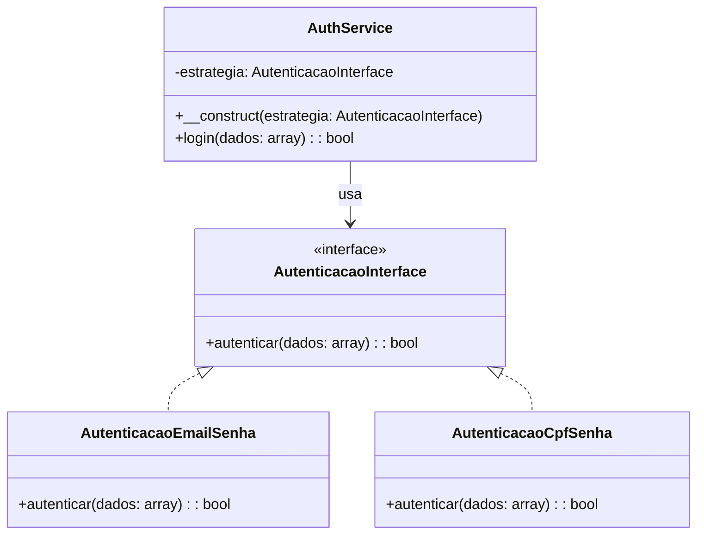

# Autenticação: Padrão Strategy e Princípios SOLID

## 🎯 Objetivo
Criar uma única classe (`AuthService`) para autenticar usuários, tratando:

- 🏫 **Escola** e 👨 **Professor** → login com **e-mail** e senha
- 🎓 **Aluno** → login com **CPF** e senha

---

## ✅ Padrão Strategy com Interface

Aplicar o **padrão de projeto Strategy**, onde cada tipo de autenticação tem uma lógica própria, mas é usada por uma única classe central.

---

## 🧱 1. Interface `AutenticacaoInterface`

```php
namespace App\Service;

interface AutenticacaoInterface {
    public function autenticar(array $dados): bool;
}
```

---

## 🧱 2. Estratégias de autenticação

### 📧 Autenticação com e-mail e senha (escola/professor)
```php
class AutenticacaoEmailSenha implements AutenticacaoInterface {
    public function autenticar(array $dados): bool {
        $email = $dados["email"] ?? '';
        $senha = $dados["senha"] ?? '';
        // lógica para professor ou escola
        // buscar no banco e verificar hash da senha
        return true; // ou false
    }
}
```

### 🆔 Autenticação com CPF e senha (aluno)
```php
class AutenticacaoCpfSenha implements AutenticacaoInterface {
    public function autenticar(array $dados): bool {
        $cpf = $dados["cpf"] ?? '';
        $senha = $dados["senha"] ?? '';
        // lógica para aluno
        // buscar no banco e verificar hash da senha
        return true; // ou false
    }
}
```

---

## ⚙️ 3. Serviço central `AuthService`

```php
class AuthService {
    private AutenticacaoInterface $estrategia;

    public function __construct(AutenticacaoInterface $estrategia) {
        $this->estrategia = $estrategia;
    }

    public function login(array $dados): bool {
        return $this->estrategia->autenticar($dados);
    }
}
```

---

## 🔌 Exemplo de uso no Controller

```php
use App\Service\{AuthService, AutenticacaoCpfSenha, AutenticacaoEmailSenha};

$tipo = $_POST["tipo_usuario"]; // "escola", "professor", "aluno"

switch ($tipo) {
    case 'aluno':
        $autenticador = new AutenticacaoCpfSenha();
        break;
    case 'professor':
    case 'escola':
        $autenticador = new AutenticacaoEmailSenha();
        break;
    default:
        throw new Exception('Tipo de usuário inválido');
}

$authService = new AuthService($autenticador);
$dados = $_POST;

if ($authService->login($dados)) {
    echo 'Login bem-sucedido!';
} else {
    echo 'Credenciais inválidas.';
}
```
ou
```php
use App\Service\{AuthService, AutenticacaoCpfSenha, AutenticacaoEmailSenha};

$tipo = $_POST["tipo_usuario"]; // "escola", "professor", "aluno"

$autenticador = match ($tipo) {
    'aluno' => new AutenticacaoCpfSenha(),
    'professor', 'escola' => new AutenticacaoEmailSenha(),
    default => throw new Exception('Tipo de usuário inválido'),
};

$authService = new AuthService($autenticador);
$dados = $_POST;

if ($authService->login($dados)) {
    echo 'Login bem-sucedido!';
} else {
    echo 'Credenciais inválidas.';
}

```
---

## 🔲 Diagrama UML – Estratégia de Autenticação



---

## 💬 Interpretação

- `AuthService` **usa** qualquer classe que implemente `AutenticacaoInterface`.
- `AutenticacaoEmailSenha` e `AutenticacaoCpfSenha` **implementam a lógica** específica de cada tipo de usuário.
- Permite adicionar novos tipos de autenticação sem alterar o núcleo do serviço.

---

## 🔐 Vantagens

✅ Reutilização de código com classes especializadas  
📦 Baixo acoplamento, facilitando manutenção  
🧪 Fácil de testar com mocks em testes automatizados  
🚀 Escalável — se amanhã precisar de autenticação por **token** ou **OAuth**, basta criar outra estratégia

---

> 🧠 Ideal para sistemas como o i-Escola, com múltiplos perfis de acesso e necessidades distintas de login.

---

**Autor:** Fabrício de Medeiros\
**Projeto:** i-Escola — Sistema de Gerenciamento Escolar
